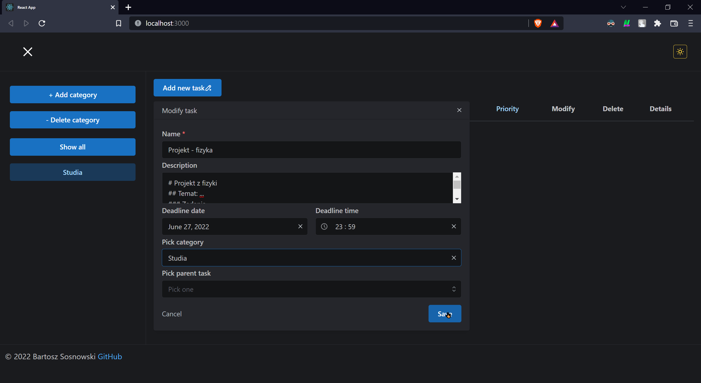

# PAINT - PROJEKT

## 1. Temat
Aplikacja typu TODO list do przechowywania i zarządzania listą zadań.

## 2. Wymagania funkcjonalne
* Dodawanie/usuwanie kategorii
* Dodawanie/modyfikacja/usuwanie zadań
* Zadania zawierają obowiązkowo nazwę oraz opcjonalnie dowolne z następujących parametrów:
    * Opis szczegółowy z obsługą markdowna
    * Termin wykonania
    * Jedno lub wiele przypomnień (np. przez email)
    * Priorytet
    * Kategorię
    * Zadanie nadrzędne
* Dzielenie zadań na kategorie
* Tworzenie zadań podrzędnych do już istniejących zadań
* Sortowanie zadań według parametrów takich jak:
    * Kolejność alfabetyczna
    * Termin wykonania
    * Czas utworzenia
    * Priotrytet
* Filtrowanie wyświetlanych zadań według kategorii
* Oznaczanie zadań jako wykonane i cofnięcie tej operacji

## 3. Wymagania niefunkcjonalne
### 3.1. Front-end
* Framework: React v18.2.0
* Język: TypeScript
* Wykorzystanie hooków

### 3.2. Back-end
* Framework: NestJS v8.2.6
* Język: TypeScript
* Architektura REST API
* Komunikacja przez protokół HTTP

### 3.3. Baza danych
* PostgreSQL v14.4

### 4. Użycie

Instrukcję użycia można znależć w odpowiednich plikach README dla backendu i frontendu.
Poniżej zrzuty ekranu z przykładowego wykorzystania

1. Motyw aplikacji

*Ciemny motyw*

*Jasny motyw*

2. Menu boczne

*Boczne menu otwierane przyciskiem w lewym górnym rogu*

3. Kategorie

*Dodawanie*

*Usuwanie*

*Po usunięciu kategorii, zadania z nią powiązane tracą przypisanie do kategorii*

*Wyświetlenie zadań z wybranej kategorii

4. Zadania

*Dodawanie zadania*

*Oznaczenie zadania jako wykonane lub odwrotnie*

*Przykład sortowania po kategorii malejąco*

*Przykład sortowania po kategorii rosnąco*

*Modyfikacja zadania*

*Wyświetlenie opisu zadania*